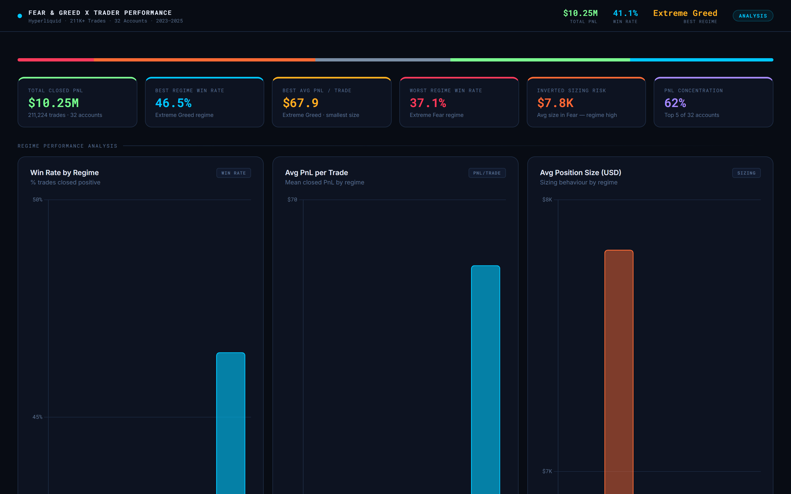
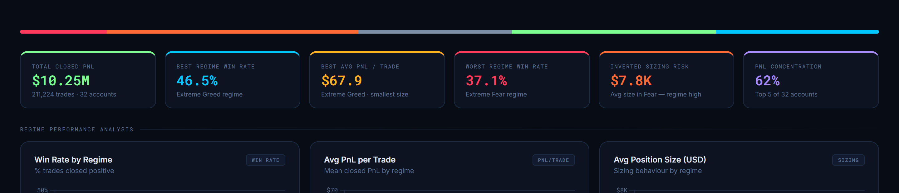
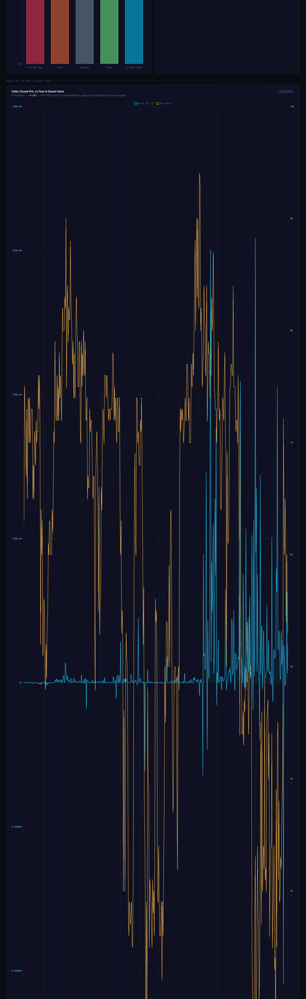
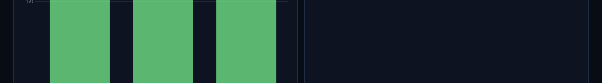

# Fear, Greed & PnL: Sentiment-Driven Trader Performance Analysis


**Author:** Hiral Sarkar | MSc Global Financial Markets | PG Data Science & AI

---

## [Live Interactive Dashboard](https://hiralsarkar.github.io/Trader-Sentiment-Analysis/dashboard.html)

> Dark-theme analytics dashboard -- 6 KPI cards, 8 interactive charts, regime breakdown bars, account performance tables. Runs instantly in any browser, no install required.



---

## Problem Statement

Retail and professional crypto traders make sizing and directional decisions continuously across varying market sentiment regimes. A common assumption is "buy the fear, sell the greed" -- but does the data actually support regime-based trading edge?

This project merges **211,224 Hyperliquid trades across 32 accounts** (2023-2025) with the **Bitcoin Fear & Greed Index** to quantify how sentiment regime affects win rate, average PnL per trade, position sizing, and fee efficiency. The goal: extract actionable rules a trader or fund manager can act on immediately.

---

## Key Findings

Derived directly from 211K+ trades across 5 sentiment regimes:

- **Extreme Greed is the alpha regime**: highest win rate (46.5%) and highest avg PnL/trade ($67.9) with the *smallest* average position size ($3.1K). The edge is concentrated in the euphoria tail -- not broad "Greed."
- **Extreme Fear is the worst regime**: lowest win rate (37.1%) and lowest avg PnL/trade ($34.5). The data offers no "buy the dip" alpha here.
- **Inverted sizing in Fear is the #1 problem**: plain Fear shows the *largest* average trade size ($7.8K) despite only 42.1% win rate -- a capital-destructive mismatch.
- **The 0-100 score is nearly useless**: raw Fear & Greed value correlates with daily PnL at only r = -0.08. The categorical regime label -- especially "Extreme" buckets -- is what actually matters.
- **PnL is heavily concentrated**: top 5 of 32 accounts generated $6.36M (~62%) of the $10.25M total. Aggregate-level win rates mask enormous per-account divergence.
- **Greed increases sell pressure**: sell mix rises to 52.9% in Greed vs ~50% in Fear -- traders are instinctively scaling out into strength, which is correct directionally.
- **Fee drag hits hardest in Fear**: avg fee per trade is $1.50 in Fear vs $0.68 in Extreme Greed -- over-trading in bad regimes compounds the loss.

---

## Dashboard Preview


*6 KPI cards -- Total PnL, best/worst regime win rates, inverted sizing risk, PnL concentration*


*Daily Closed PnL vs Fear & Greed Index value -- correlation barely -0.08; regime label matters, raw score does not*


*Top and bottom 10 accounts -- top 5 drive 62% of total PnL; bottom 5 are consistent drags*

---

## Strategic Recommendations

| Priority | Action | Rationale |
|----------|--------|-----------|
| **1 -- Immediate** | Size up 30-50% in Extreme Greed | Win rate 46.5%, avg PnL/trade $67.9, current size already smallest ($3.1K) -- clear room to add |
| **2 -- Immediate** | Cut size 30-50% in Extreme Fear | Worst win rate (37.1%) and worst PnL/trade ($34.5) -- less is more |
| **3 -- Critical** | Fix inverted sizing in plain Fear | $7.8K avg size at 42.1% WR is the single biggest capital efficiency problem |
| **4 -- Tactical** | Reduce trade frequency in Fear | $1.50 avg fee in Fear vs $0.68 in Extreme Greed -- over-trading in bearish regimes destroys net PnL |
| **5 -- Analytical** | Build per-coin, per-regime playbooks | TRUMP: +$81 avg PnL in Fear vs -$454 in Greed. FARTCOIN: opposite. Universal rules miss this |
| **6 -- Structural** | Audit bottom-5 accounts | Consistent drags while top 5 drive 62% of profit -- reallocate or retrain |

---

## Project Structure

```
Trader-Sentiment-Analysis/
|
+-- Sentiment_Trader_Analysis.ipynb   <- Full EDA, merging, analysis, visualisations
+-- app.py                            <- Streamlit interactive dashboard
+-- dashboard.html                    <- Static dashboard (GitHub Pages, no install)
+-- dashboard_data.js                 <- Pre-aggregated JSON data for the HTML dashboard
+-- data/
|   +-- historical_data.csv.gz        <- 211,224 Hyperliquid trades, 32 accounts (gzipped)
|   +-- fear_greed_index.csv          <- Bitcoin Fear & Greed Index, daily (2018-2025)
+-- images/                           <- Dashboard screenshots
+-- requirements.txt
+-- README.md
```

---

## Tech Stack

| Layer | Tool | Detail |
|-------|------|--------|
| Data Merging | Python / Pandas | 211K trade rows merged with daily F&G index on date key |
| Analysis | NumPy / SciPy | Regime aggregation, correlation, win rate calculation |
| Notebook Viz | Matplotlib / Seaborn / Plotly | EDA charts, regime breakdowns, account analysis |
| Interactive App | Streamlit | Full Python dashboard with live filters |
| Static Dashboard | Chart.js 4.4 + HTML/CSS | Dark-theme GitHub Pages dashboard, zero dependencies |

---

## Setup

### Static Dashboard (fastest)
Open [`dashboard.html`](dashboard.html) directly in any browser -- no install needed. Or view the [live GitHub Pages version](https://hiralsarkar.github.io/Trader-Sentiment-Analysis/dashboard.html).

### Streamlit App
```bash
pip install -r requirements.txt
streamlit run app.py
```

### Jupyter Notebook
```bash
pip install -r requirements.txt
jupyter notebook Sentiment_Trader_Analysis.ipynb
```
Run all cells top to bottom. The notebook contains the full merge logic, regime analysis, account-level breakdowns, and per-coin regime cross-tab.

---

## Dataset

| File | Description |
|------|-------------|
| `data/historical_data.csv.gz` | 211,224 Hyperliquid trades, 32 accounts (2023-2025). Columns: account, coin, side, size, price, closed_pnl, fee, timestamp |
| `data/fear_greed_index.csv` | Bitcoin Fear & Greed Index daily values + categorical label (2018-2025). Source: alternative.me |

The two datasets are merged on `date` (trade date = F&G date) to produce a regime-labelled trade table.

---

## Analysis Phases

1. Data loading & validation -- shape, dtypes, nulls, date range alignment
2. Regime merge -- join trades to daily F&G index; assign 5-bucket and 3-bucket regime labels
3. Univariate regime analysis -- trade count, PnL, win rate, avg size, fee per regime
4. Correlation analysis -- Pearson r between daily PnL and F&G raw value
5. Directional bias -- buy/sell mix by regime
6. Per-coin regime breakdown -- avg PnL/trade for top 10 coins across Fear/Neutral/Greed
7. Account-level analysis -- total PnL, win rate, trade count per account; top/bottom 10
8. Concentration analysis -- PnL breakdown by account rank
9. Recommendations -- regime-specific sizing rules, fee reduction, per-coin playbooks

---

## Resume Talking Points

- Merged and analysed **211,224 crypto trades** across 32 accounts with an external sentiment index -- end-to-end in Python
- Quantified regime-level trading edge: Extreme Greed produces 46.5% win rate and $67.9 avg PnL/trade vs 37.1% and $34.5 in Extreme Fear
- Identified the **inverted sizing problem** -- traders use largest position sizes in the worst-performing regime (Fear, $7.8K avg)
- Proved raw sentiment score is a **weak predictor** (r = -0.08); categorical regime label is the actionable signal
- Built both a **Streamlit app** and a **static GitHub Pages dashboard** from the same dataset
- Surfaced **concentration risk**: top 5 of 32 accounts drive 62% of total PnL -- critical for portfolio allocation decisions

---

*Built to demonstrate quantitative analytics and data storytelling for trading, fintech, and AI model risk roles.*
